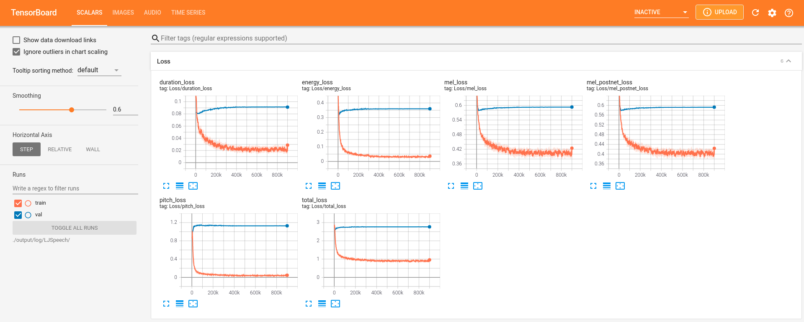
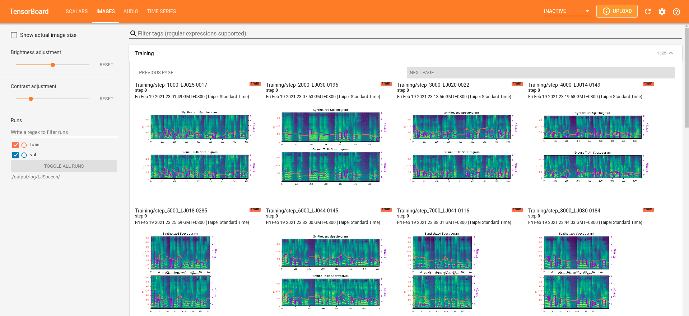
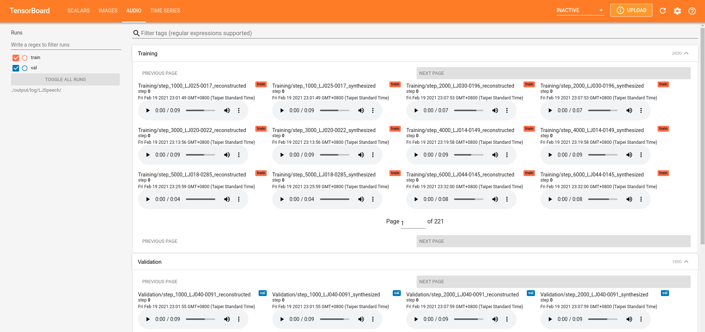

# FastSpeech 2 - PyTorch 实现

## 一、项目介绍

本作业为南开大学语音信息处理大作业，选择的具体任务为语音合成——参考[GitHub - FastSpeech2](https://github.com/ming024/FastSpeech2), NAR 语音合成系统。


## 二、环境配置

（开始时踩坑无数，包括各种软件包版本不对应问题、CUDA版本不对应问题、新版代码规范与旧版不匹配问题等等，在本地和服务器都经历了多次尝试，期间一度转向尝试vits、vits2甚至语音识别的wenet等的github项目，在不同项目的参考下以及历时一周多的尝试经验下总结出如下步骤，逐行运行即可顺利配置好实验环境），对于vit、vits2和wenet也是同样道理（也顺利进入到了训练步骤但是训练时间即便加上早停机制也有点长，而Fastspeech训练时间相对更友好，所以选择此项目）。


### 2.1 实验环境：

- AutoDL：[AutoDL算力云](https://www.autodl.com/console/homepage/personal)
  - 选择镜像：PyTorch 2.0.0，Python 3.8(ubuntu20.04)，Cuda 11.8
  - GPU：RTX 4090D(24GB) * 1
  - CPU：15 vCPU Intel(R) Xeon(R) Platinum 8474C
  - 内存：80GB
  - 硬盘：系统盘30GB，数据盘50GB


### 2.2 配置步骤：

1. 注意到requirements.txt中的pytorch版本是1.7，所以选择创建环境时也配置一个比较旧的版本，这里首先打开终端或者Anaconda Prompt，选择创建一个较低的python3.7版本（这个创建的版本可以<=本机python版本，按照本机的python3.11新版本会有各种不兼容问题)：

   ```shell
   conda create -n Fastspeech python=3.7
   ```

2. 如果是本地的Anaconda Prompt打开——直接激活这个虚拟环境：

   ```shell
   conda activate Fastspeech
   ```

   如果是用云服务器——则是：

   ```
   conda init
   然后关闭终端，重新打开一个终端再激活
   conda activate Fastspeech
   ```

3. 接下来先单独安装pytorch1.7.0相关的包，从pytorch官网找旧版本安装[Previous PyTorch Versions | PyTorch](https://pytorch.org/get-started/previous-versions/)，指令如下：

   ```shell
   conda install pytorch==1.7.0 torchvision==0.8.0 torchaudio==0.7.0 cudatoolkit=11.0 -c pytorch
   ```

4. 然后再按照原来项目的提示，安装requirements.txt：

   ```shell
   pip3 install -r requirements.txt
   ```

   但是里面还是有一个软件会安装失败，把pyworld == 0.2.10改成pyworld == 0.2.12就能顺利安装了。

5. 其他的按照原项目的README文件所说的步骤就可以顺利开启训练和结果推理了（如果有报错按照报错提示创建相应文件夹，解压相应文件夹即可）


### 2.3 推理

#### 2.3.1 单句推理

如果想用官方的预训练模型先测试效果的话，先下载[预训练模型](https://drive.google.com/drive/folders/1DOhZGlTLMbbAAFZmZGDdc77kz1PloS7F?usp=sharing)，然后放在 ``output/ckpt/LJSpeech/``、``output/ckpt/AISHELL3`` 或 ``output/ckpt/LibriTTS/`` 目录下（先自己创建相应文件夹）。

对于单说话人英语 TTS，先创建 `output/result/LJSpeech` 目录，然后运行：

```
python3 synthesize.py --text "YOUR_DESIRED_TEXT" --restore_step 900000 --mode single -p config/LJSpeech/preprocess.yaml -m config/LJSpeech/model.yaml -t config/LJSpeech/train.yaml

例如：
python3 synthesize.py --text "nankai university" --restore_step 900000 --mode single -p config/LJSpeech/preprocess.yaml -m config/LJSpeech/model.yaml -t config/LJSpeech/train.yaml
```

对于多说话人普通话 TTS，先创建 `output/result/AISHELL3` 目录，运行：

```
python3 synthesize.py --text "大家好" --speaker_id SPEAKER_ID --restore_step 600000 --mode single -p config/AISHELL3/preprocess.yaml -m config/AISHELL3/model.yaml -t config/AISHELL3/train.yaml

例如：
python synthesize.py --text "南开大学" --speaker_id 0 --restore_step 600000 --mode single -p config/AISHELL3/preprocess.yaml -m config/AISHELL3/model.yaml -t config/AISHELL3/train.yaml
```

对于多说话人英语 TTS，先创建 `output/result/LibriTTS` 目录，运行：

```
python3 synthesize.py --text "YOUR_DESIRED_TEXT"  --speaker_id SPEAKER_ID --restore_step 800000 --mode single -p config/LibriTTS/preprocess.yaml -m config/LibriTTS/model.yaml -t config/LibriTTS/train.yaml
```


#### 2.3.2 批量推理

如果想批量推理，以单说话人英语 TTS为例，运行：

```
python3 synthesize.py --source preprocessed_data/LJSpeech/val.txt --restore_step 900000 --mode batch -p config/LJSpeech/preprocess.yaml -m config/LJSpeech/model.yaml -t config/LJSpeech/train.yaml
```

即可把 ``preprocessed_data/LJSpeech/val.txt`` 中的所有文字都合成为语音。


#### 2.3.3 可以指定音高/音量/语速比

可以通过指定所需的音高/音量/语速比来控制合成语音的音高/音量/语速。
例如，可以通过以下命令将语速提高 20% 并将音量降低 20%

```
python3 synthesize.py --text "YOUR_DESIRED_TEXT" --restore_step 900000 --mode single -p config/LJSpeech/preprocess.yaml -m config/LJSpeech/model.yaml -t config/LJSpeech/train.yaml --duration_control 0.8 --energy_control 0.8
```


### 2.4 训练

#### 2.4.1 下载数据集

先下载数据集：

- [LJSpeech](https://keithito.com/LJ-Speech-Dataset/): 单说话人英语数据集，包括 13100 段女性说话者从 7 本非小说书籍中阅读的短音频片段，总计约 24 小时。
- [AISHELL-3](http://www.aishelltech.com/aishell_3): 包含 218 位男性和女性说话者的普通话 TTS 数据集，总计约 85 小时。
- [LibriTTS](https://research.google/tools/datasets/libri-tts/): 包含 2456 位说话者的多说话人英语数据集，总计 585 小时。

以下以 LJSpeech 为例。


#### 2.4.2 预处理

运行：

```
python3 prepare_align.py config/LJSpeech/preprocess.yaml
```


将[支持的数据集的对齐文件](https://drive.google.com/drive/folders/1DBRkALpPd6FL9gjHMmMEdHODmkgNIIK4?usp=sharing)解压到 ``preprocessed_data/LJSpeech/TextGrid/``。

然后运行预处理脚本：

```
python3 preprocess.py config/LJSpeech/preprocess.yaml
```


#### 2.4.3 训练

先补充安装所需的软件包：

```
pip install protobuf==3.20.0
```

然后通过以下命令开始训练模型：

```
python3 train.py -p config/LJSpeech/preprocess.yaml -m config/LJSpeech/model.yaml -t config/LJSpeech/train.yaml
```

训练的部分截图如下：


### 2.5 TensorBoard

在本地主机上启动 TensorBoard：

```
tensorboard --logdir output/log/LJSpeech
```

会显示损失曲线、合成的 mel 频谱图和音频：






## 参考文献

- [FastSpeech 2: Fast and High-Quality End-to-End Text to Speech](https://arxiv.org/abs/2006.04558), Y. Ren, *et al*.
- [xcmyz 的 FastSpeech 实现](https://github.com/xcmyz/FastSpeech)
- [TensorSpeech 的 FastSpeech 2 实现](https://github.com/TensorSpeech/TensorflowTTS)
- [rishikksh20 的 FastSpeech 2 实现](https://github.com/rishikksh20/FastSpeech2)

