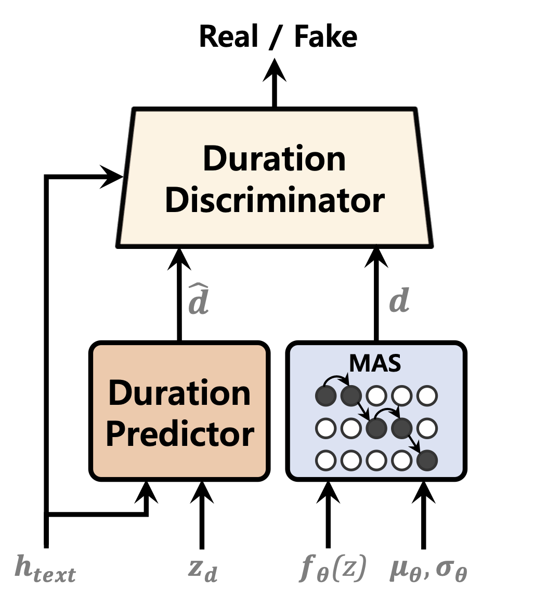
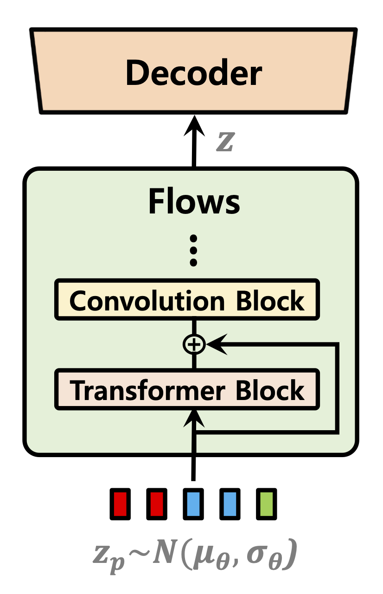
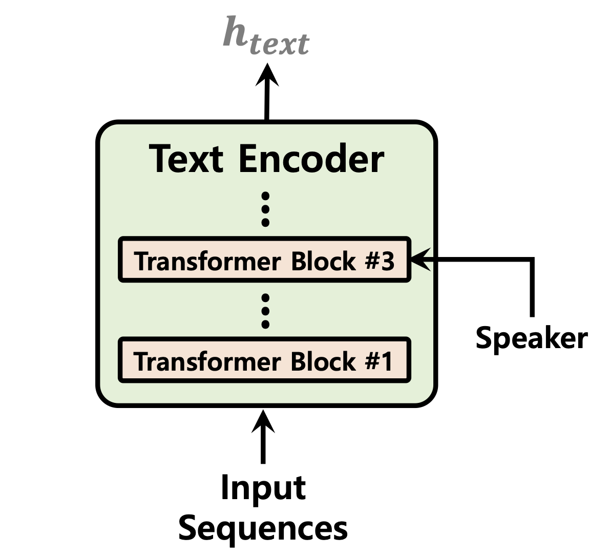

# VITS2: Improving Quality and Efficiency of Single-Stage Text-to-Speech with Adversarial Learning and Architecture Design

### Jungil Kong, Jihoon Park, Beomjeong Kim, Jeongmin Kim, Dohee Kong, Sangjin Kim

### SK Telecom, South Korea

Single-stage text-to-speech models have been actively studied recently, and their results have outperformed two-stage pipeline systems. Although the previous single-stage model has made great progress, there is room for improvement in terms of its intermittent unnaturalness, computational efficiency, and strong dependence on phoneme conversion. In this work, we introduce VITS2, a single-stage text-to-speech model that efficiently synthesizes a more natural speech by improving several aspects of the previous work. We propose improved structures and training mechanisms and present that the proposed methods are effective in improving naturalness, similarity of speech characteristics in a multi-speaker model, and efficiency of training and inference. Furthermore, we demonstrate that the strong dependence on phoneme conversion in previous works can be significantly reduced with our method, which allows a fully end-to-end single-stage approach.

Demo: https://vits-2.github.io/demo/

Paper: https://arxiv.org/abs/2307.16430

Unofficial implementation of VITS2. This is a work in progress. Please refer to [TODO](#todo) for more details.

<table style="width:100%">
  <tr>
    <th>Duration Predictor</th>
    <th>Normalizing Flows</th>
    <th>Text Encoder</th>
  </tr>
  <tr>
    <td></td>
    <td></td>
    <td></td>
  </tr>
</table>

## Audio Samples

[In progress]

Audio sample after 52,000 steps of training on 1 GPU for LJSpeech dataset:
https://github.com/daniilrobnikov/vits2/assets/91742765/d769c77a-bd92-4732-96e7-ab53bf50d783

## Installation:

<a name="installation"></a>

**Clone the repo**

```shell
git clone git@github.com:daniilrobnikov/vits2.git
cd vits2
```

## Setting up the conda env

This is assuming you have navigated to the `vits2` root after cloning it.

**NOTE:** This is tested under `python3.11` with conda env. For other python versions, you might encounter version conflicts.

**PyTorch 2.0**
Please refer [requirements.txt](requirements.txt)

```shell
# install required packages (for pytorch 2.0)
conda create -n vits2 python=3.11
conda activate vits2
pip install -r requirements.txt

conda env config vars set PYTHONPATH="/path/to/vits2"
```

## Download datasets

There are three options you can choose from: LJ Speech, VCTK, or custom dataset.

1. LJ Speech: [LJ Speech dataset](#lj-speech-dataset). Used for single speaker TTS.
2. VCTK: [VCTK dataset](#vctk-dataset). Used for multi-speaker TTS.
3. Custom dataset: You can use your own dataset. Please refer [here](#custom-dataset).

### LJ Speech dataset

1. download and extract the [LJ Speech dataset](https://keithito.com/LJ-Speech-Dataset/)

```shell
wget https://data.keithito.com/data/speech/LJSpeech-1.1.tar.bz2
tar -xvf LJSpeech-1.1.tar.bz2
cd LJSpeech-1.1/wavs
rm -rf wavs
```

3. preprocess mel-spectrograms. See [mel_transform.py](preprocess/mel_transform.py)

```shell
python preprocess/mel_transform.py --data_dir /path/to/LJSpeech-1.1 -c datasets/ljs_base/config.yaml
```

3. preprocess text. See [prepare/filelists.ipynb](datasets/ljs_base/prepare/filelists.ipynb)

4. rename or create a link to the dataset folder.

```shell
ln -s /path/to/LJSpeech-1.1 DUMMY1
```

### VCTK dataset

1. download and extract the [VCTK dataset](https://www.kaggle.com/datasets/showmik50/vctk-dataset)

```shell
wget https://datashare.is.ed.ac.uk/bitstream/handle/10283/3443/VCTK-Corpus-0.92.zip
unzip VCTK-Corpus-0.92.zip
```

2. (optional): downsample the audio files to 22050 Hz. See [audio_resample.ipynb](preprocess/audio_resample.ipynb)

3. preprocess mel-spectrograms. See [mel_transform.py](preprocess/mel_transform.py)

```shell
python preprocess/mel_transform.py --data_dir /path/to/VCTK-Corpus-0.92 -c datasets/vctk_base/config.yaml
```

4. preprocess text. See [prepare/filelists.ipynb](datasets/ljs_base/prepare/filelists.ipynb)

5. rename or create a link to the dataset folder.

```shell
ln -s /path/to/VCTK-Corpus-0.92 DUMMY2
```

### Custom dataset

1. create a folder with wav files
2. duplicate the `ljs_base` in `datasets` directory and rename it to `custom_base`
3. open [custom_base](datasets/custom_base) and change the following fields in `config.yaml`:

```yaml
data:
  training_files: datasets/custom_base/filelists/train.txt
  validation_files: datasets/custom_base/filelists/val.txt
  text_cleaners: # See text/cleaners.py
    - phonemize_text
    - tokenize_text
    - add_bos_eos
  cleaned_text: true # True if you ran step 6.
  language: en-us # language of your dataset. See espeak-ng
  sample_rate: 22050 # sample rate, based on your dataset
  ...
  n_speakers: 0 # 0 for single speaker, > 0 for multi-speaker
```

4. preprocess mel-spectrograms. See [mel_transform.py](preprocess/mel_transform.py)

```shell
python preprocess/mel_transform.py --data_dir /path/to/custom_dataset -c datasets/custom_base/config.yaml
```

6. preprocess text. See [prepare/filelists.ipynb](datasets/ljs_base/prepare/filelists.ipynb)

**NOTE:** You may need to install `espeak-ng` if you want to use `phonemize_text` cleaner. Please refer [espeak-ng](https://github.com/espeak-ng/espeak-ng)

7. rename or create a link to the dataset folder.

```shell
ln -s /path/to/custom_dataset DUMMY3
```

## Training Examples

```shell
# LJ Speech
python train.py -c datasets/ljs_base/config.yaml -m ljs_base

# VCTK
python train_ms.py -c datasets/vctk_base/config.yaml -m vctk_base

# Custom dataset (multi-speaker)
python train_ms.py -c datasets/custom_base/config.yaml  -m custom_base
```

## Inference Examples

See [inference.ipynb](inference.ipynb) and [inference_batch.ipynb](inference_batch.ipynb)

## Pretrained Models

[In progress]

## Todo

- [ ] model (vits2)
  - [x] update TextEncoder to support speaker conditioning
  - [x] support for high-resolution mel-spectrograms in training. See [mel_transform.py](preprocess/mel_transform.py)
  - [x] Monotonic Alignment Search with Gaussian noise
  - [x] Normalizing Flows using Transformer Block
  - [ ] Stochastic Duration Predictor with Time Step-wise Conditional Discriminator
- [ ] model (YourTTS)
  - [ ] Language Conditioning
  - [ ] Speaker Encoder
- [ ] model (NaturalSpeech)
  - [x] KL Divergence Loss after Prior Enhancing
  - [ ] GAN loss for e2e training
- [ ] other
  - [x] support for batch inference
  - [x] special tokens in tokenizer
  - [x] test numba.jit and numba.cuda.jit implementations of MAS. See [monotonic_align.py](monotonic_align.py)
  - [ ] KL Divergence Loss between TextEncoder and Projection
  - [ ] support for streaming inference. Please refer [vits_chinese](https://github.com/PlayVoice/vits_chinese/blob/master/text/symbols.py)
  - [ ] use optuna for hyperparameter tuning
- [ ] future work
  - [ ] update model to vits2. Please refer [VITS2](https://arxiv.org/abs/2307.16430)
  - [ ] update model to YourTTS with zero-shot learning. See [YourTTS](https://arxiv.org/abs/2112.02418)
  - [ ] update model to NaturalSpeech. Please refer [NaturalSpeech](https://arxiv.org/abs/2205.04421)

## Acknowledgements

- This is unofficial repo based on [VITS2](https://arxiv.org/abs/2307.16430)
- g2p for multiple languages is based on [phonemizer](https://github.com/bootphon/phonemizer)
- We also thank GhatGPT for providing writing assistance.

## References

- [VITS2: Improving Quality and Efficiency of Single-Stage Text-to-Speech with Adversarial Learning and Architecture Design](https://arxiv.org/abs/2307.16430)
- [Conditional Variational Autoencoder with Adversarial Learning for End-to-End Text-to-Speech](https://arxiv.org/abs/2106.06103)
- [YourTTS: Towards Zero-Shot Multi-Speaker TTS and Zero-Shot Voice Conversion for everyone](https://arxiv.org/abs/2112.02418)
- [NaturalSpeech: End-to-End Text to Speech Synthesis with Human-Level Quality](https://arxiv.org/abs/2205.04421)
- [A TensorFlow implementation of Google's Tacotron speech synthesis with pre-trained model (unofficial)](https://github.com/keithito/tacotron)

# VITS2


# VITS2：通过对抗学习和架构设计提高单阶段文本到语音的质量和效率

### Jungil Kong, Jihoon Park, Beomjeong Kim, Jeongmin Kim, Dohee Kong, Sangjin Kim

### 韩国SK电信

单阶段文本到语音模型最近得到了积极研究，其结果优于两阶段流水线系统。尽管之前的单阶段模型已经取得了很大的进步，但在间歇性不自然、计算效率和对音素转换的强依赖方面仍有改进空间。在这项工作中，我们介绍了VITS2，这是一种通过改进先前工作的多个方面来有效合成更自然语音的单阶段文本到语音模型。我们提出了改进的结构和训练机制，并展示了所提出的方法在提高自然性、多说话人模型中语音特征的相似性以及训练和推理效率方面的有效性。此外，我们证明了我们的方法可以显著减少之前工作中对音素转换的强依赖，从而实现完全端到端的单阶段方法。

演示: https://vits-2.github.io/demo/

论文: https://arxiv.org/abs/2307.16430

这是VITS2的非官方实现。此项目正在进行中。请参阅[TODO](#todo)以获取更多详细信息。

<table style="width:100%">
  <tr>
    <th>持续时间预测器</th>
    <th>正则化流</th>
    <th>文本编码器</th>
  </tr>
  <tr>
    <td></td>
    <td></td>
    <td></td>
  </tr>
</table>

## 音频示例

[进行中]

在1个GPU上训练LJSpeech数据集52,000步后的音频示例：
https://github.com/daniilrobnikov/vits2/assets/91742765/d769c77a-bd92-4732-96e7-ab53bf50d783

## 安装:

<a name="installation"></a>

**克隆仓库**

```shell
git clone git@github.com:daniilrobnikov/vits2.git
cd vits2
```

## 设置conda环境

假设你已经在克隆后导航到了`vits2`根目录。

**注意:** 此步骤在`python3.11`和conda环境下测试过。对于其他Python版本，可能会遇到版本冲突。

**PyTorch 2.0**
请参考[requirements.txt](requirements.txt)

```shell
# 安装所需的包 (适用于pytorch 2.0)
conda create -n vits2 python=3.11
conda activate vits2
pip install -r requirements.txt

conda env config vars set PYTHONPATH="/path/to/vits2"


conda env config vars set PYTHONPATH="D:/Speech Information/vits2"

```


```shell
conda create -n newvits python=3.10

conda activate newvits

conda install pytorch==2.0.0 torchvision==0.15.0 torchaudio==2.0.0 pytorch-cuda=11.8 -c pytorch -c nvidia

pip install -r requirements.txt

conda env config vars set PYTHONPATH="D:/Speech Information/vits2"

conda env config vars set PYTHONPATH="autodl-tmp/vits2"
autodl-tmp/vits2

```


## 下载数据集

你可以选择以下三个选项之一：LJ Speech、VCTK或自定义数据集。

1. LJ Speech: [LJ Speech数据集](#lj-speech-dataset)。用于单说话人TTS。
2. VCTK: [VCTK数据集](#vctk-dataset)。用于多说话人TTS。
3. 自定义数据集: 你可以使用自己的数据集。请参阅[这里](#custom-dataset)。

### LJ Speech数据集

1. 下载并解压[LJ Speech数据集](https://keithito.com/LJ-Speech-Dataset/)

```shell
wget https://data.keithito.com/data/speech/LJSpeech-1.1.tar.bz2
tar -xvf LJSpeech-1.1.tar.bz2
cd LJSpeech-1.1/wavs
rm -rf wavs  为啥要删？？？
```

3. 预处理梅尔频谱图。参见[mel_transform.py](preprocess/mel_transform.py)

```shell
python preprocess/mel_transform.py --data_dir /path/to/LJSpeech-1.1 -c datasets/ljs_base/config.yaml


python preprocess/mel_transform.py --data_dir LJSpeech-1.1 -c datasets/ljs_base/config.yaml

python preprocess/mel_transform.py --data_dir autodl-tmp/vits2/LJSpeech-1.1 -c datasets/ljs_base/config.yaml

conda install -c conda-forge sox

autodl-tmp/vits2/LJSpeech-1.1
D:/Speech Information/vits2/LJSpeech-1.1
```


终于可以了呜呜呜


3. 预处理文本。参见[prepare/filelists.ipynb](datasets/ljs_base/prepare/filelists.ipynb)


```shell
放到filelists.py文件

apt-get update
apt-get install espeak-ng

python filelists.py


```


3. 重命名或创建数据集文件夹的链接。

```shell
ln -s /path/to/LJSpeech-1.1 DUMMY1

ln -s /root/autodl-tmp/vits2/LJSpeech-1.1 DUMMY1


ln -s LJSpeech-1.1 DUMMY1

/root/autodl-tmp/vits2/LJSpeech-1.1
```

### VCTK数据集

1. 下载并解压[VCTK数据集](https://www.kaggle.com/datasets/showmik50/vctk-dataset)

```shell
wget https://datashare.is.ed.ac.uk/bitstream/handle/10283/3443/VCTK-Corpus-0.92.zip
unzip VCTK-Corpus-0.92.zip
```

2. (可选): 将音频文件下采样至22050 Hz。参见[audio_resample.ipynb](preprocess/audio_resample.ipynb)

3. 预处理梅尔频谱图。参见[mel_transform.py](preprocess/mel_transform.py)

```shell
python preprocess/mel_transform.py --data_dir /path/to/VCTK-Corpus-0.92 -c datasets/vctk_base/config.yaml
```

4. 预处理文本。参见[prepare/filelists.ipynb](datasets/ljs_base/prepare/filelists.ipynb)

5. 重命名或创建数据集文件夹的链接。

```shell
ln -s /path/to/VCTK-Corpus-0.92 DUMMY2
```

### 自定义数据集

1. 创建一个包含wav文件的文件夹
2. 在`datasets`目录中复制`ljs_base`并重命名为`custom_base`
3. 打开[custom_base](datasets/custom_base)并更改`config.yaml`中的以下字段：

```yaml
data:
  training_files: datasets/custom_base/filelists/train.txt
  validation_files: datasets/custom_base/filelists/val.txt
  text_cleaners: # 参见 text/cleaners.py
    - phonemize_text
    - tokenize_text
    - add_bos_eos
  cleaned_text: true # 如果你运行了第6步，则为True。
  language: en-us # 数据集的语言。参见espeak-ng
  sample_rate: 22050 # 采样率，基于你的数据集
  ...
  n_speakers: 0 # 0表示单说话人，> 0表示多说话人
```

4. 预处理梅尔频谱图。参见[mel_transform.py](preprocess/mel_transform.py)

```shell
python preprocess/mel_transform.py --data_dir /path/to/custom_dataset -c datasets/custom_base/config.yaml
```

6. 预处理文本。参见[prepare/filelists.ipynb](datasets/ljs_base/prepare/filelists.ipynb)

**注意:** 如果你想使用`phonemize_text`清理器，可能需要安装`espeak-ng`。请参考[espeak-ng](https://github.com/espeak-ng/espeak-ng)

7. 重命名或创建数据集文件夹的链接。

```shell
ln -s /path/to/custom_dataset DUMMY3
```

## 训练示例

```shell
# LJ Speech
python train.py -c datasets/ljs_base/config.yaml -m ljs_base

# VCTK
python train_ms.py -c datasets/vctk_base/config.yaml -m vctk_base

# 自定义数据集 (多说话人)
python train_ms.py -c datasets/custom_base/config.yaml  -m custom_base
```


但是内存不够，修改batch_size=32，然后运行：


## 推理示例

参见[inference.ipynb](inference.ipynb)和[inference_batch.ipynb](inference_batch.ipynb)

## 预训练模型

[进行中]

## 待办事项

- [ ] 模型 (vits2)
  - [x] 更新TextEncoder以支持说话人条件
  - [x] 支持训练中的高分辨率梅尔频谱图。参见[mel_transform.py](preprocess/mel_transform.py)
  - [x] 使用高斯噪声的单调对齐搜索
  - [x] 使用Transformer块的正则化流
  - [ ] 具有时间步长条件判别器的随机持续时间预测器
- [ ] 模型 (YourTTS)
  - [ ] 语言条件
  - [ ] 说话人编码器
- [ ] 模型 (NaturalSpeech)
  - [x] 优化后增强的KL散度损失
  - [ ] 用于端到端训练的GAN损失
- [ ] 其他
  - [x] 支持批量推理
  - [x] 分词器中的特殊标记
  - [x] 测试numba.jit和numba.cuda.jit的MAS实现。参见[monotonic_align.py](monotonic_align.py)
  - [ ] TextEncoder和Projection之间的KL散度损

失
  - [ ] 支持流式推理。请参考[vits_chinese](https://github.com/PlayVoice/vits_chinese/blob/master/text/symbols.py)
  - [ ] 使用optuna进行超参数调整
- [ ] 未来工作
  - [ ] 更新模型至vits2。请参考[VITS2](https://arxiv.org/abs/2307.16430)
  - [ ] 更新模型至YourTTS，支持零样本学习。参见[YourTTS](https://arxiv.org/abs/2112.02418)
  - [ ] 更新模型至NaturalSpeech。请参考[NaturalSpeech](https://arxiv.org/abs/2205.04421)

## 致谢

- 这是基于[VITS2](https://arxiv.org/abs/2307.16430)的非官方仓库
- 多语言的g2p基于[phonemizer](https://github.com/bootphon/phonemizer)
- 我们还感谢GhatGPT提供的写作协助。

## 参考文献

- [VITS2: Improving Quality and Efficiency of Single-Stage Text-to-Speech with Adversarial Learning and Architecture Design](https://arxiv.org/abs/2307.16430)
- [Conditional Variational Autoencoder with Adversarial Learning for End-to-End Text-to-Speech](https://arxiv.org/abs/2106.06103)
- [YourTTS: Towards Zero-Shot Multi-Speaker TTS and Zero-Shot Voice Conversion for everyone](https://arxiv.org/abs/2112.02418)
- [NaturalSpeech: End-to-End Text to Speech Synthesis with Human-Level Quality](https://arxiv.org/abs/2205.04421)
- [A TensorFlow implementation of Google's Tacotron speech synthesis with pre-trained model (unofficial)](https://github.com/keithito/tacotron)

# VITS2
